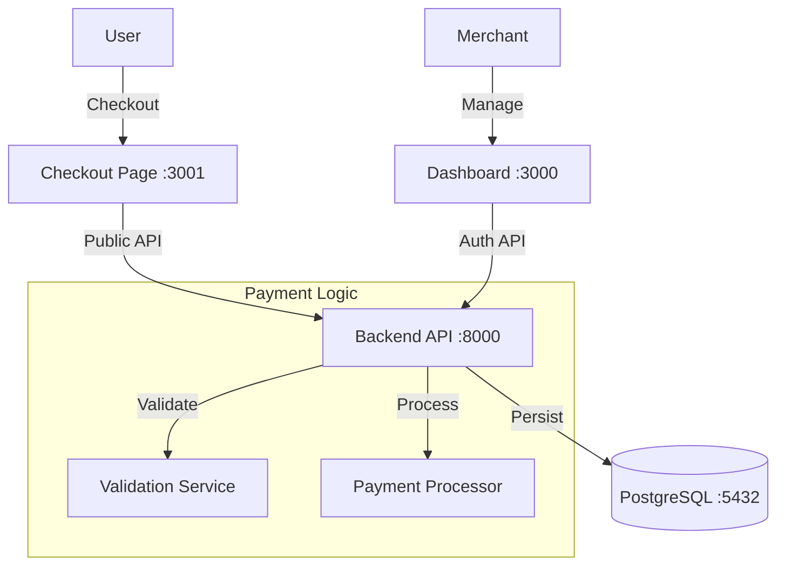

# Payment Gateway

## Overview
A comprehensive payment gateway simulation featuring a RESTful API, Merchant Dashboard, and Hosted Checkout Page. The system supports multi-method payment processing (UPI and Cards) with realistic validation logic, state management, and merchant authentication.

## Project Structure
- `backend/`: Node.js Express API (Port 8000)
- `frontend/`: React Dashboard (Vite) (Port 3000)
- `checkout-page/`: React Checkout Page (Vite) (Port 3001)
- `docker-compose.yml`: Orchestration for all services + PostgreSQL

## Setup & Run
1. **Prerequisites**: Ensure Docker Desktop is running.
2. **Start Services**:
   ```bash
   docker-compose up -d --build
   ```
3. **Access Services**:
   - **API**: http://localhost:8000
   - **Dashboard**: http://localhost:3000
   - **Checkout**: http://localhost:3001

## Test Credentials
The system automatically seeds a test merchant on startup:
- **Email**: `test@example.com`
- **API Key**: `key_test_abc123`
- **API Secret**: `secret_test_xyz789`

## System Architecture



### Components
1.  **Backend API**: Handles order creation, payment processing, and merchant authentication.
2.  **PostgreSQL**: Stores merchants, orders, and payments with relational integrity.
3.  **Dashboard**: Merchant interface to view transactions and analytics.
4.  **Checkout Page**: Customer-facing page to complete payments.

## Database Schema

### 1. Merchants
| Field | Type | Description |
|-------|------|-------------|
| id | UUID | Primary Key |
| name | VARCHAR | Merchant Name |
| email | VARCHAR | Unique Email |
| api_key | VARCHAR | Authentication Key |
| api_secret | VARCHAR | Authentication Secret |
| is_active | BOOLEAN | Status |

### 2. Orders
| Field | Type | Description |
|-------|------|-------------|
| id | VARCHAR | PK (order_...) |
| merchant_id | UUID | FK -> Merchants |
| amount | INTEGER | Amount in paise |
| status | VARCHAR | created, paid |

### 3. Payments
| Field | Type | Description |
|-------|------|-------------|
| id | VARCHAR | PK (pay_...) |
| order_id | VARCHAR | FK -> Orders |
| merchant_id | UUID | FK -> Merchants |
| method | VARCHAR | upi, card |
| status | VARCHAR | processing, success, failed |
| vpa | VARCHAR | UPI ID (optional) |
| card_network | VARCHAR | visa, mastercard, etc. (optional) |

## API Documentation

### Authentication
Include headers in requests:
- `X-Api-Key`: [Your API Key]
- `X-Api-Secret`: [Your API Secret]

### Endpoints

#### 1. Health Check
`GET /health`
Returns system status.

#### 2. Create Order
`POST /api/v1/orders`
- **Body**:
  ```json
  {
    "amount": 50000,
    "currency": "INR",
    "receipt": "invoice_1",
    "notes": { "desc": "Payment" }
  }
  ```
- **Response**: Order object with `id`.

#### 3. Create Payment
`POST /api/v1/payments`
- **Body (UPI)**:
  ```json
  {
    "order_id": "order_...",
    "method": "upi",
    "vpa": "user@bank"
  }
  ```
- **Body (Card)**:
  ```json
  {
    "order_id": "order_...",
    "method": "card",
    "card": {
      "number": "4242...",
      "expiry_month": "12",
      "expiry_year": "2025",
      "cvv": "123",
      "holder_name": "User"
    }
  }
  ```

#### 4. Get Payment
`GET /api/v1/payments/{payment_id}`
Returns payment status and details.

## Testing Flow
1.  **Login to Dashboard**: Go to http://localhost:3000/login (use test credentials).
2.  **Create Order**: Use Postman/Curl to create an order via API.
3.  **Open Checkout**: Navigate to `http://localhost:3001/checkout?order_id={id_from_step_2}`.
4.  **Complete Payment**: Enter dummy UPI or Card details.
5.  **Verify**: Check the status on the Checkout Page and verify the transaction appears in the Dashboard.

## Docker Configuration
The `docker-compose.yml` orchestrates:
- `postgres`: Database (Health-checked)
- `api`: Backend (Depends on DB)
- `dashboard`: Frontend (Depends on API)
- `checkout`: Frontend (Depends on API)

Environment variables are configured for **Test Mode** to ensure deterministic behavior during evaluation.